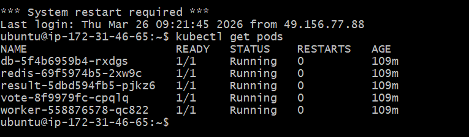
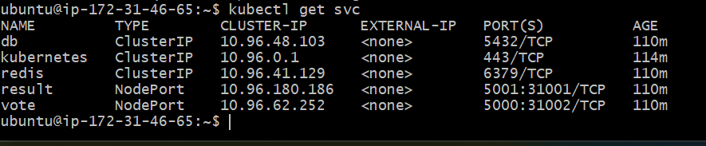
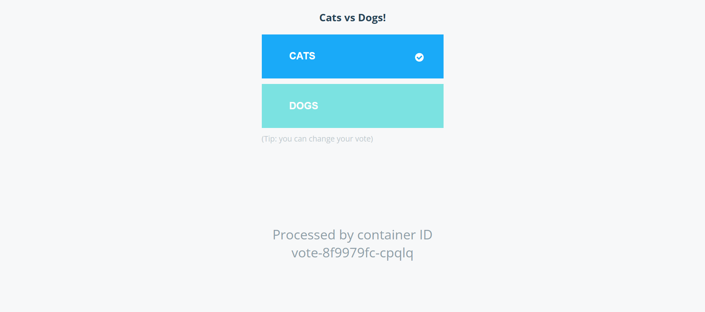

# Kubernetes Voting Application Deployment (AWS + KIND)

## 📌 Project Overview
This project demonstrates the deployment of a multi-container voting application using Kubernetes on an AWS EC2 instance.

## ⚙️ What I Did
- Launched an AWS EC2 instance (Ubuntu)
- Installed Docker, kubectl, and KIND
- Created a Kubernetes cluster using KIND
- Deployed the voting application using Kubernetes YAML files
- Configured NodePort services for external access
- Opened required ports in AWS Security Groups
- Monitored and debugged application using kubectl

## 🧱 Application Architecture
- Frontend Voting App (Python)
- Result App (Node.js)
- Redis (for vote collection)
- PostgreSQL (database)
- Worker Service (.NET)

  ```md
## 🏗️ Architecture


## 📸 Screenshots

### Pods Running


### Services


### Voting App


### Result App


## 🚀 Deployment Steps

```bash
kubectl apply -f k8s-specifications/

🌐 Access
Voting App → http://<EC2-IP>:31002
Result App → http://<EC2-IP>:31001
📊 Monitoring & Debugging
Used kubectl commands:
kubectl get pods
kubectl get svc
kubectl logs
Verified service exposure via NodePort
